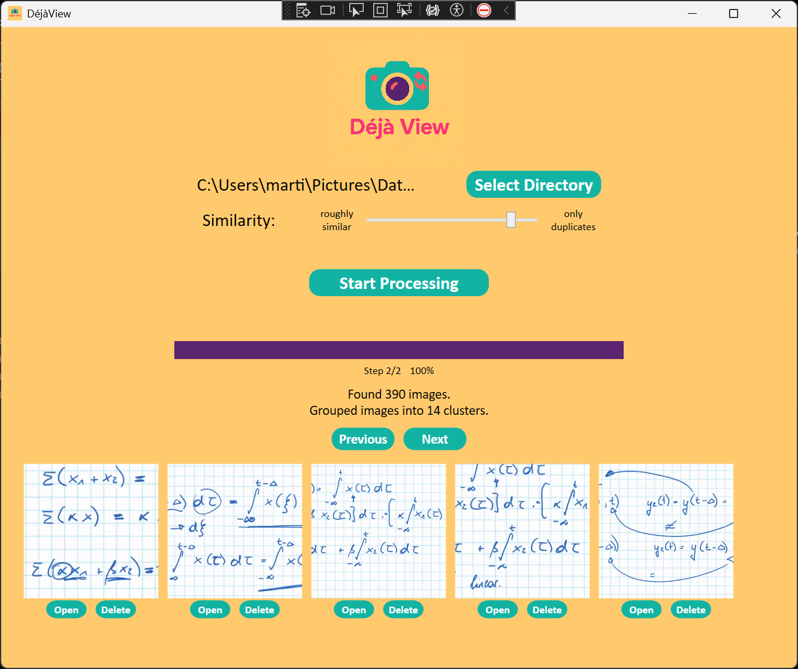

# DejaView GPU

This project is a speedup of our original [DejaView CPU](https://github.com/lisakrimbacher/DejaView) implementation. Note that this is faster by orders of magnitude by using image re-scaling and batching. Nonetheless, there is a loss of quality because all images are initially re-scaled to a fixed scale to better be parallelized in batches of the same dimension.

Requirements:
- Windows x64 (note that you only build for x64 and not "Any" in Visual Studio)
- CUDA 12.x (and adding /bin to path)
- cuDNN 9.x (and adding /bin to path)

The project in "DejaView/" is a WPF application which can be used to find similar images (or duplicate) images in a given directory and its subdirectories using MobileNetv2 embeddings. When running the app, one can specify whether roughly semantically similar images, just duplicate images or an interpolated value in between should be retrieved. The application is efficiently implemented in .NET8.0 using suitable async and parallel operations.

Structure of repository:
- DejaView/DejaView: WPF application
- DejaView/Benchmark: Code used to benchmark 4 different approaches to process files
- Slides_DejaView.pdf: Slides used in the presentation on May 9th 2025

Authors: Martin Dallinger, Lisa Krimbacher
(May 2025)
